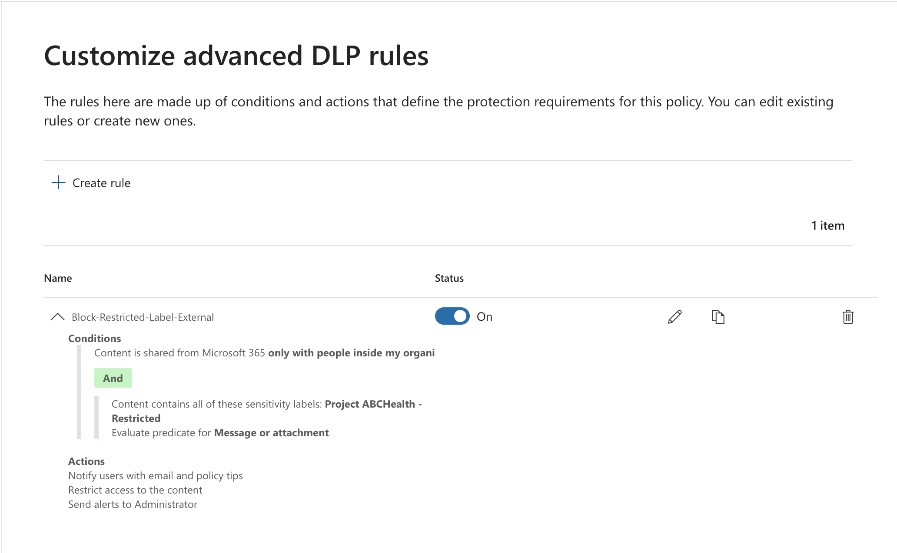

# Purview Data Protection Implementation (HIPPA & DLP)

*This project was performed in a controlled lab environment.
ABCHealth is a fictional entity created for the purpose of demonstrating HIPAA-compliant security configurations within Microsoft Purview.*

## Project Overview

This project demonstrates the implementation of a HIPAA-compliant Data Loss Prevention (DLP) solution for ABCHealth. The goal was to secure Protected Health Information (PHI) by restricting external sharing while maintaining internal collaboration for clinical staff.

## Technical Architecture

**Platform:** Microsoft Purview

**Environment:** ABCHealth M365 Tenant

**Protected Locations:** Exchange, SharePoint, OneDrive

**Compliance Framework:** HIPAA Technical Safeguards

## Implementation Steps

### 1. Data Classification

Created a Sensitivity Label named ABCHealth - Restricted.

**Scope:** Files and Emails.

**Protection:** Encryption restricted to internal ABCHealth users.

<table>
  <tr>
    <td></td>
    <td></td>
  </tr>
</table>

### 2. DLP Policy Configuration

Built a custom DLP policy with the following logic:

- Condition 1: Content contains ABCHealth - Restricted label.

- Condition 2: Recipient is outside the organization.

- Action: Block everyone (external) and notify the user.

### 3. User Experience & Notifications

Configured Policy Tips to educate staff on HIPAA requirements and allowed Business Justification overrides for auditability.

### 4. Records Management & Data Lifecycle

To ensure long-term compliance with HIPAA (45 CFR § 164.316), a Record Retention strategy was implemented to manage the finality of medical documentation.

- File Plan Descriptors: Configured specialized metadata (Reference ID: ABC-MED-001) to link clinical documents directly to HIPAA citations within the Purview File Plan.

- Record Declaration: Created a Retention Label that marks items as a "Record."

- Locking Logic: Set to start "Locked" by default to ensure immediate immutability upon application.

- Retention Period: 7 Years (Triggered from the date the item was created).

- Immutability Strategy: Leveraged Standard Records to prevent accidental deletion while allowing "Record Versioning" for clinical updates that require an audit trail.
  

## Implementation Validation & Deployment Status

### 1. Configuration Validation: Tenant Readiness

- Status: Passed

- Verification: Executed Get-OrganizationConfig via PowerShell.

- Result: IsDehydrated: False. This confirms the ABCHealth environment is successfully "rehydrated" and capable of processing advanced Record versioning.
    

### 2. Policy Deployment Status

- Status: Pending Propagation

- Verification: Checked Purview > Data Lifecycle Management > Label Policies.

- Result: The "ABCHealth Record Policy" status is "Success (Pending)".

- Current State: The backend logic is active, but the frontend UI (SharePoint/OneDrive) is in the standard 24-hour sync window.
      

### 3. DLP Logic Validation

- Status: Pending Sync

- Observation: The DLP rule targeting the "Restricted" label is staged.

- Current State: Testing is paused until the label is available for selection on test documents.
    

## HIPAA Mapping

*The following table maps the technical configurations implemented in this lab to the specific HIPAA Security Rule standards they satisfy.*

| HIPAA Requirement | Technical Implementation | Purpose |
| :---------------- | :----------------------- | :------ |
| **Transmission Security** | **DLP Policy:** "Block everyone" for external recipients. | Prevents unauthorized PHI from leaving the ABCHealth network. |
| **Access Control** | **Sensitivity Label:** Encryption for ABCHealth users. | Ensures only authorized staff can decrypt and view the data. |
| **Audit Controls** | **Incident Reporting:** Alerts and Justification logs. | Creates a record of who tried to share sensitive data and why. |
| **Integrity** | **Content Marking:** Visual headers and watermarks. | Identifies sensitivity to prevent accidental mishandling. |

## Conclusion

This implementation establishes a robust security posture for ABCHealth, satisfying both HIPAA Privacy (via DLP) and Security (via Records Management) requirements. By automating the protection of PHI and the immutability of medical records, we reduce the risk of human error and provide a verifiable audit trail for compliance officers.

## Future Improvements

- Automatic Labeling: Transition from manual to automatic labeling using Sensitive Information Types (SITs) to detect SSNs or Medical Record Numbers instantly.
- Cloud Security Integration: Deploy Microsoft Defender for Cloud Apps to extend these protections to unmanaged devices and third-party SaaS applications.
