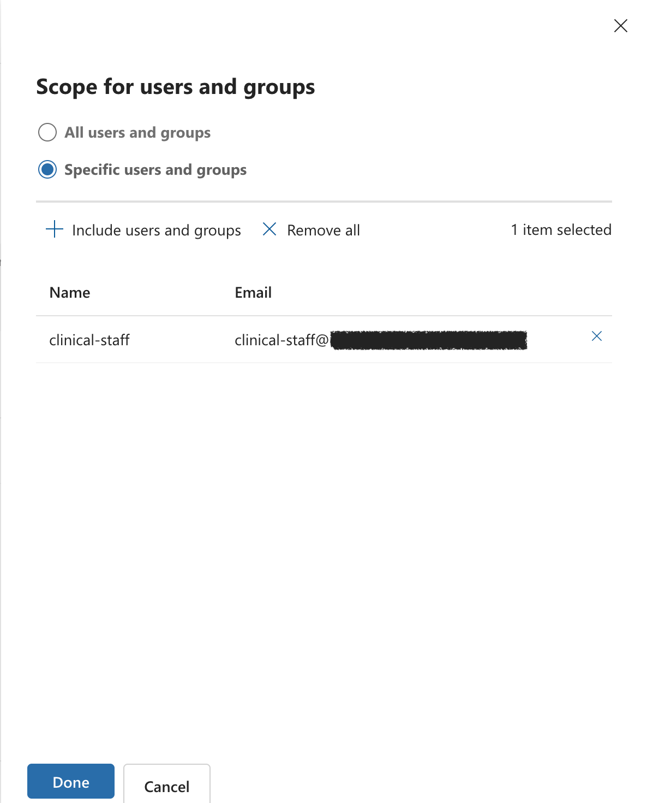
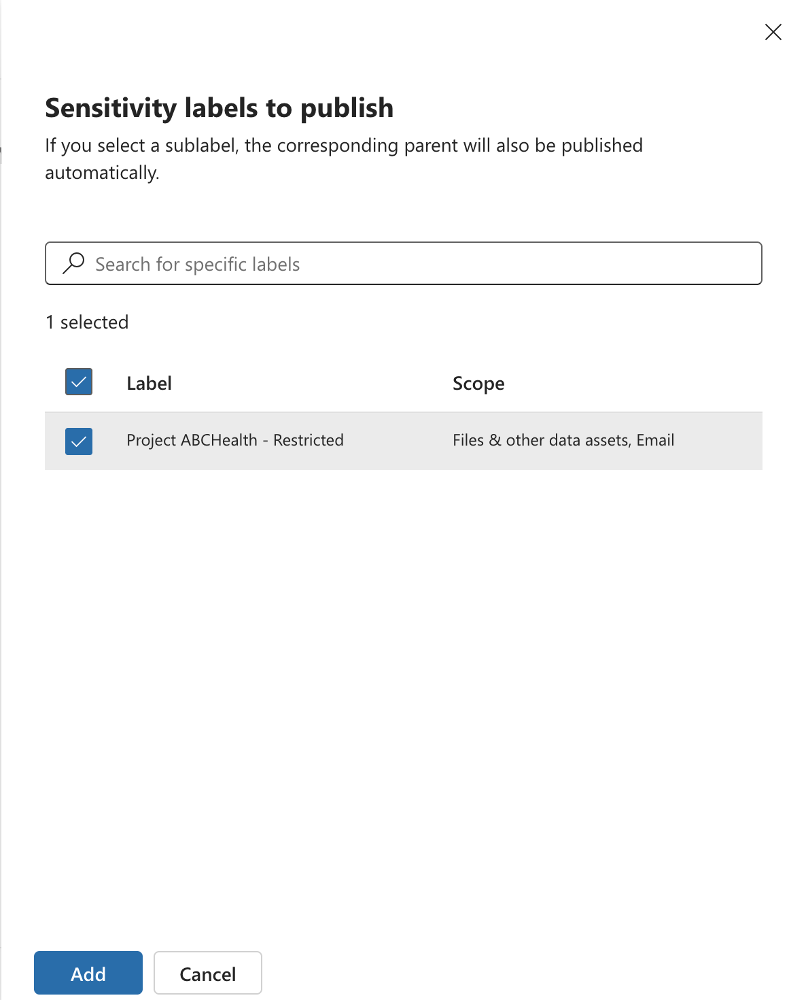

# Purview-HIPAA

*This project was performed in a controlled lab environment.
ABCHealth is a fictional entity created for the purpose of demonstrating HIPAA-compliant security configurations within Microsoft Purview.*

## Project Overview

This project demonstrates the implementation of a HIPAA-compliant Data Loss Prevention (DLP) solution for ABCHealth. The goal was to secure Protected Health Information (PHI) by restricting external sharing while maintaining internal collaboration for clinical staff.

## Technical Architecture

**Platform:** Microsoft Purview

**Environment:** ABCHealth M365 Tenant

**Protected Locations:** Exchange, SharePoint, OneDrive

**Compliance Framework:** HIPAA Technical Safeguards

## Implementation Steps

### 1. Data Classification

Created a Sensitivity Label named ABCHealth - Restricted.

**Scope:** Files and Emails.

**Protection:** Encryption restricted to internal ABCHealth users.

<table>
  <tr>
    <td></td>
    <td></td>
  </tr>
</table>

### 2. DLP Policy Configuration

Built a custom DLP policy with the following logic:

- Condition 1: Content contains ABCHealth - Restricted label.

- Condition 2: Recipient is outside the organization.

- Action: Block everyone (external) and notify the user.

### 3. User Experience & Notifications

Configured Policy Tips to educate staff on HIPAA requirements and allowed Business Justification overrides for auditability.

Testing & Results

Test 1: External Sharing Block (Success)

Attempted to email a labeled document to an external Gmail address. The system successfully blocked the transmission.

Test 2: Internal Collaboration (Success)

Verified that internal clinical staff can still access and share the same document within the ABCHealth domain without friction.
Test 3: Incident Reporting

Generated an automatic alert in the Purview Admin Center for the blocked event.

[INSERT SCREENSHOT: Purview Alert Dashboard showing the logged violation
